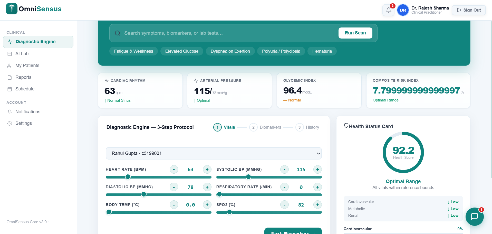
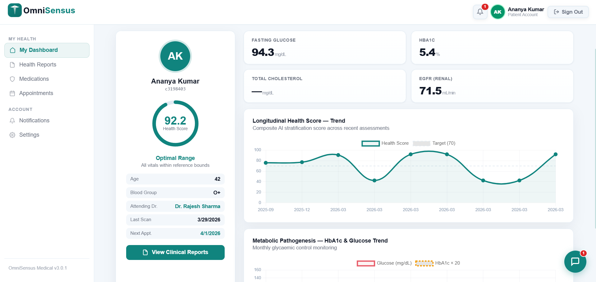

# OmniSensus Platform

<p align="center">
	
</p>

## Overview

**OmniSensus** is a next-generation AI-powered healthcare platform for patient diagnostics, risk stratification, and clinical workflow automation. It features a modern web dashboard (Next.js), a robust Python backend (FastAPI), and a dedicated ML microservice for predictive analytics.

---

## Features

- **AI Diagnostic Engine:** Real-time patient risk scoring and disease prediction (diabetes, heart, kidney, etc.)
- **Doctor & Patient Portals:** Role-based dashboards for practitioners and patients
- **Automated Reports:** PDF/HTML report generation and export
- **Appointment Scheduling:** Book, manage, and track appointments
- **Notifications:** Email, push, and in-app notifications
- **Secure Authentication:** JWT-based login, MFA, and audit logging
- **ML Microservice:** Pluggable Python ML engine for advanced analytics
- **Admin Controls:** User management, analytics, and system settings

---

## Tech Stack

- **Frontend:** Next.js, React, CSS Modules
- **Backend:** FastAPI, SQLAlchemy, PostgreSQL
- **ML Service:** Python, scikit-learn, pandas
- **Deployment:** Netlify, Render, Docker

---

## Quick Start

### 1. Web App (Next.js)
```bash
pnpm install
pnpm dev
# Visit http://localhost:3000
```

### 2. Backend (FastAPI)
```bash
cd OmniSensus-Backend
pip install -r requirements.txt
uvicorn main:app --reload
# Visit http://localhost:8000/docs
```

### 3. ML Microservice
```bash
cd OmniSensus-ML_model
pip install -r requirements_ml.txt
python app.py
```

---

## Directory Structure

```
OmniSensus-Backend/      # FastAPI backend
OmniSensus-ML_model/     # ML microservice
src/                     # Next.js frontend
public/assets/images/    # Logos & images
```

---

## Preview


<div align="center" style="margin-bottom: 32px;">
	
	<br/>
	
</div>

---

<div align="center">
	<h3 style="margin-bottom: 0.5em; color: #10847E;">Platform Dashboards</h3>
	<table>
		<tr>
			<td align="center" style="padding: 24px;">
				
				<div style="font-weight: 600; margin-top: 12px; color: #222; font-size: 1.1em;">Doctor Dashboard</div>
				<div style="color: #888; font-size: 0.95em;">AI-powered clinical insights, patient management, and analytics</div>
			</td>
			<td align="center" style="padding: 24px;">
				
				<div style="font-weight: 600; margin-top: 12px; color: #222; font-size: 1.1em;">Patient Dashboard</div>
				<div style="color: #888; font-size: 0.95em;">Personal health records, diagnostics, and appointment tracking</div>
			</td>
		</tr>
	</table>
</div>

---

---

## Test Users

For testing, use the following credentials:

| Role    | Username   | Password    | User ID (if needed) |
|---------|------------|-------------|---------------------|
| Doctor  | Dr.Sharma  | MedPass24   | (auto)              |
| Patient | P-00001    | Health2026  | (auto)              |

*User IDs are assigned by the backend and can be found in the database or via the admin panel.*

---

## License

MIT License. © 2026 OmniSensus Team
